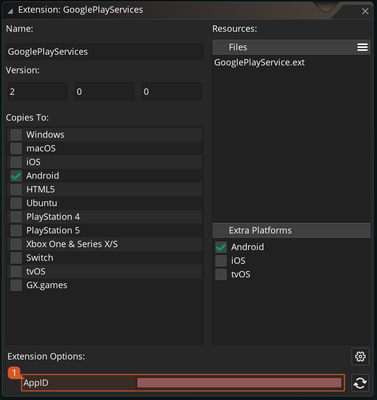

@title Extension Setup

<!-- Page HTML do not touch -->
<a />
[Back To Top](#top)

# Setup

The Google Play Services extension is to be used alongside your Google Developer account ([web page](https://developers.google.com/)). All the required personal leaderboard ids and achievement ids should be managed from there.

> **:warning: IMPORTANT**
>
>  Before using this extension make sure to correctly set up your Android application following the steps on [this article](https://help.yoyogames.com/hc/en-us/articles/360004274212-Google-Play-Services-How-To-Use-This-In-Your-Games). It's also important to note that the demo provided with extension is a reference demo meaning it cannot be played as is, as it would need our `.keystore` and our Google Services ID which cannot be included with the package.
 

1. The extension setup will require the user to **double click** the extension asset in the asset browser and fill in the information regarding the GooglePlayServices account.  

   

2. As the Google Developer Console layout might change in the future you can check their official guide on setting up leaderboards: [Adding Leaderboards](https://developers.google.com/games/services/common/concepts/leaderboards#creating_a_leaderboard).

3. As the Google Developer Console layout might change in the future you can check their official guide on setting up achievements: [Adding Achievements](https://developers.google.com/games/services/common/concepts/achievements#creating_an_achievement).

  

---