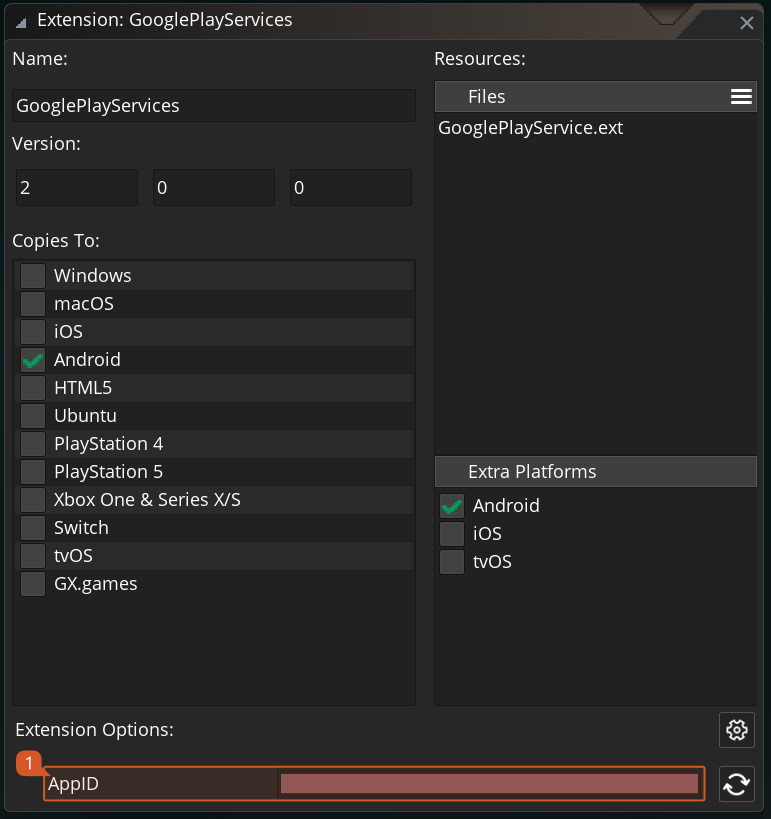

@title Extension Setup

# Import

Download the **.yymps** package from the [Releases](https://github.com/YoYoGames/GMEXT-GooglePlayServices/releases/) section of this repository. Drag it into your GameMaker window or use the **Tools** -> **Import Local Package** option.

In the Import window, make sure you import at least the **GooglePlayServices** folder and the **ExtensionCore** folder.

# Setup

The Google Play Services extension is meant to be used alongside your Google Developer account
([web page](https://developers.google.com/)). All of the leaderboard IDs and the achievement IDs
that your game needs are created and managed from there.

[[Important: Before you use this extension you should make sure that your Android application has
been set up correctly, following the steps that are listed on the ${page.google_setup} page. Note
also that the demo that is provided with the extension is a reference demo, which means that it
cannot be played as it is, as it would need our own `.keystore` and our own Google Services ID and
neither of those can be included with the package.]]

1. To set up the extension, double-click the extension asset in the Asset Browser and fill in the
   application ID. See
   [this section of the developer documentation](https://developer.android.com/games/pgs/console/setup#avoid_common_issues)
   for where to find it:  

   

2. The layout of the Google Developer Console may change in the future, so for setting up
   leaderboards you should follow the official guide from Google:
   [Adding Leaderboards](https://developers.google.com/games/services/common/concepts/leaderboards#creating_a_leaderboard).

3. The layout of the Google Developer Console may change in the future, so for setting up
   achievements you should follow the official guide from Google:
   [Adding Achievements](https://developers.google.com/games/services/common/concepts/achievements#creating_an_achievement).

Once that is done, see ${page.getting_started} for the order in which the functions of this
extension should be called in GML.
