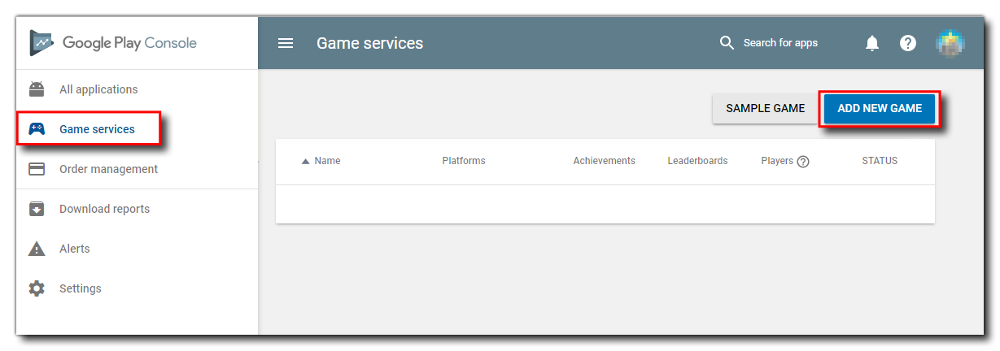
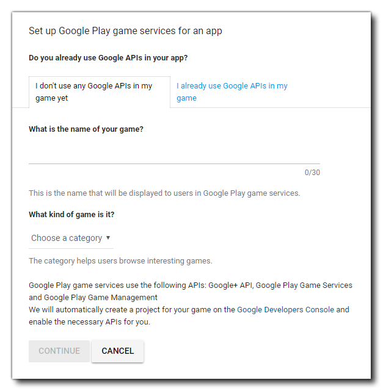
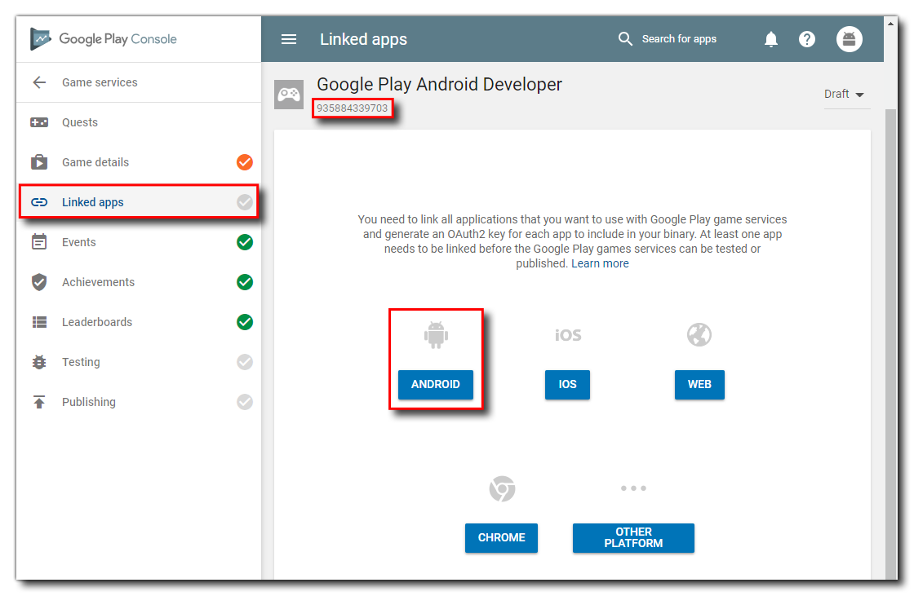
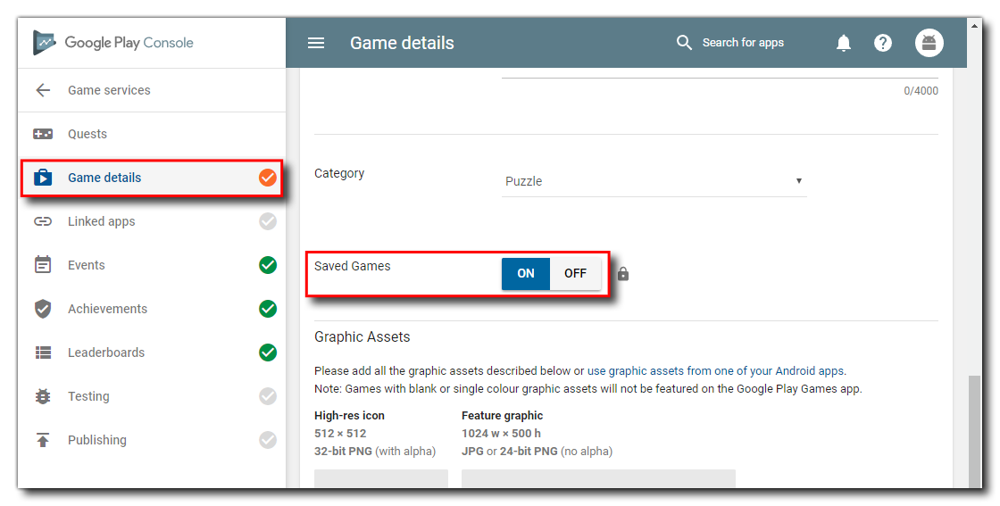

@title Google Setup

# Google Play Setup

Before you can add any cloud sync code and test it, you first have to [set up an app listing](https://support.google.com/googleplay/android-developer/answer/113469?hl=en) on your [Google Play Developer Console](https://developer.android.com/distribute/console/index.html) for the game and you will also have had to upload an APK to one of the available channels for testing - either Internal Test (recommended), Alpha or Beta is fine. Once that has been done, you will also need to set up the **Game Services** for the app.

From the Developer dashboard, click the **Game Services** button on the left, then click the **Add New Game** button:

This will then show you a screen where you have to give some details about the game, including a name and a category:

After filling in the information and pressing **Continue**, you will now need to go to the **Linked Apps** section and get the **App ID** and set the app as being for **Android**:

The **App ID** is shown at the top and you will need to take a note of it as we'll be using it in GameMaker later. When you click the Android button, you will then be prompted to give some information about the app you want to link the services too, and you should link it to an app that you have previously uploaded to the store.

Once that's done, we have one final task and that is to enable Cloud Saving for the game services. This is done from the **Game Details** page:

Before publishing the game publicly, you will need to complete the rest of the game details on this page, but for now, you can simply enable saving and then continue on to add the code into your project in GameMaker.

 